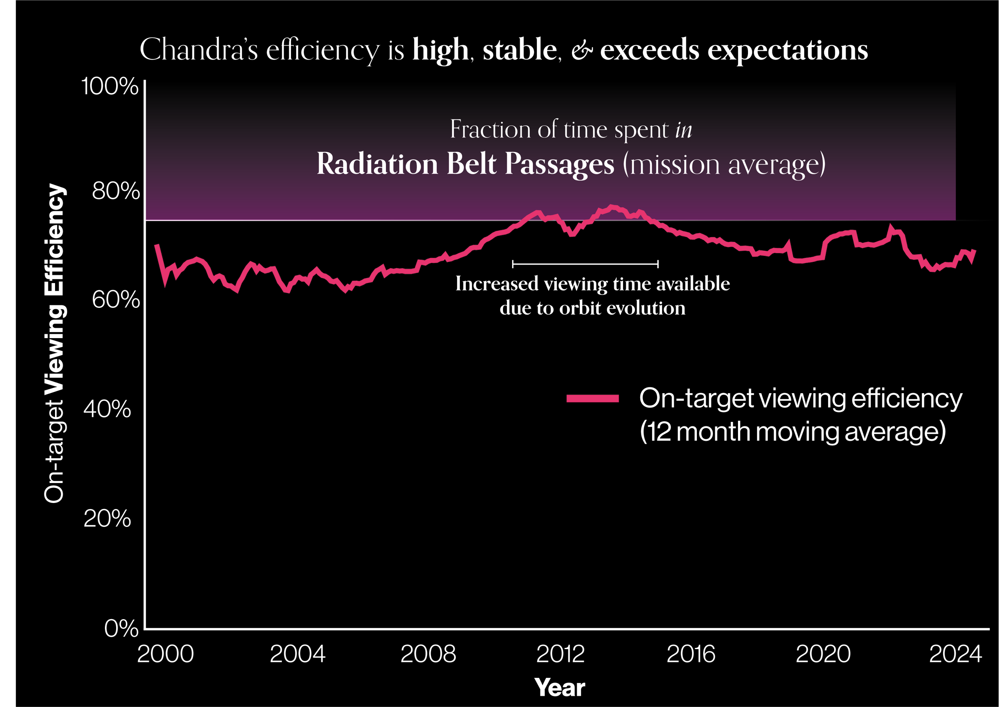
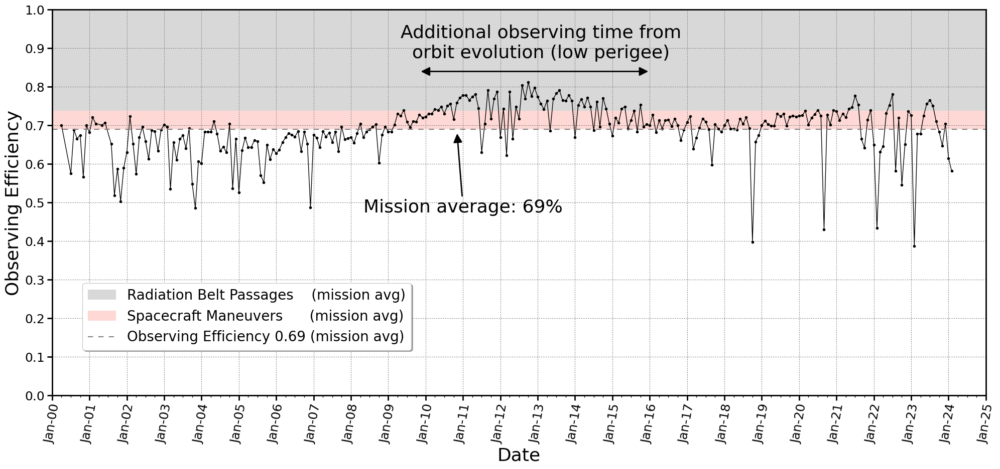

Observing Efficiency
====================

This plot shows the observing efficiency as a function of time throughout the mission lifetime, showing also radiation belt passages (when Chandra cannot observe but can take calibration data) and maneuvers (in between observations but instrument setup for the next observation can occur during these times). 

Same data with more technical information:

