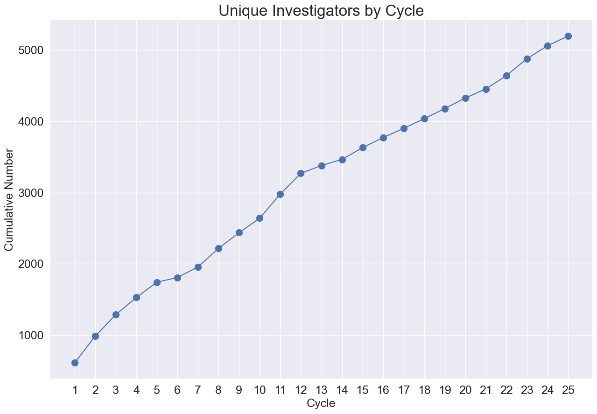
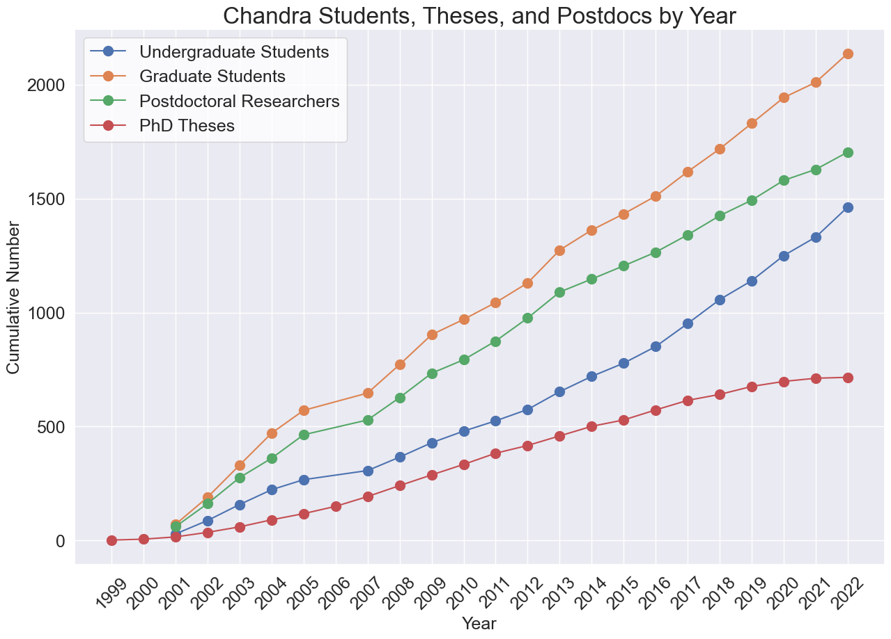
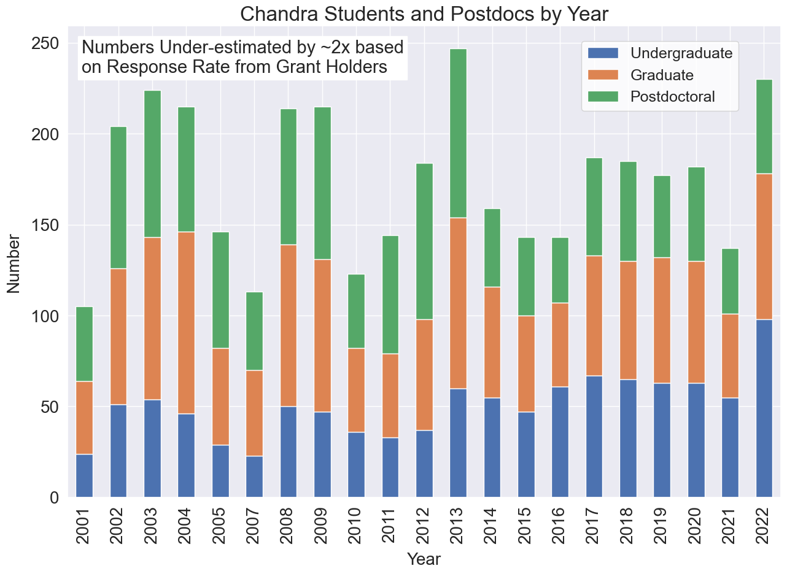
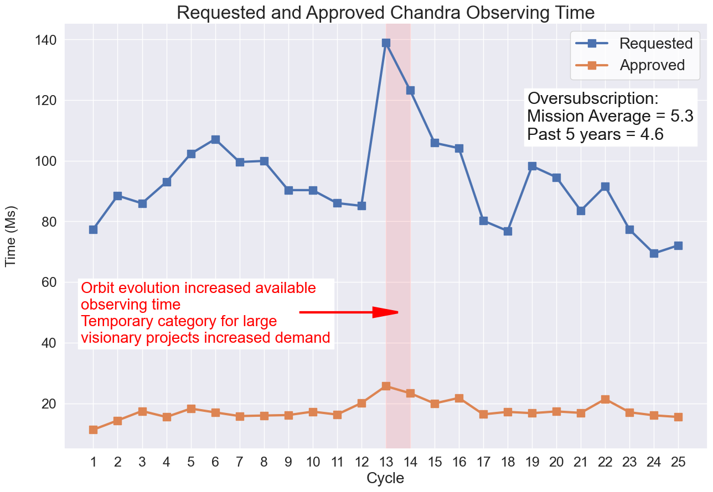

Proposal Data
=============

Cumulative Investigators and Students
-------------------------------------

This plot shows the cumulative number of unique investigators who have been awarded Chandra time.

This plot shows the cumulative number of students, postdocs, and Ph.D. theses enabled by Chandra science.

This plot shows the number of students and postdocs enabled by Chandra science per year.

Oversubscription Rate of Proposals
----------------------------------

The plot shows requested exposure time from observing proposals and accepted time. The oversubscription rate is roughly a factor of 4. 

