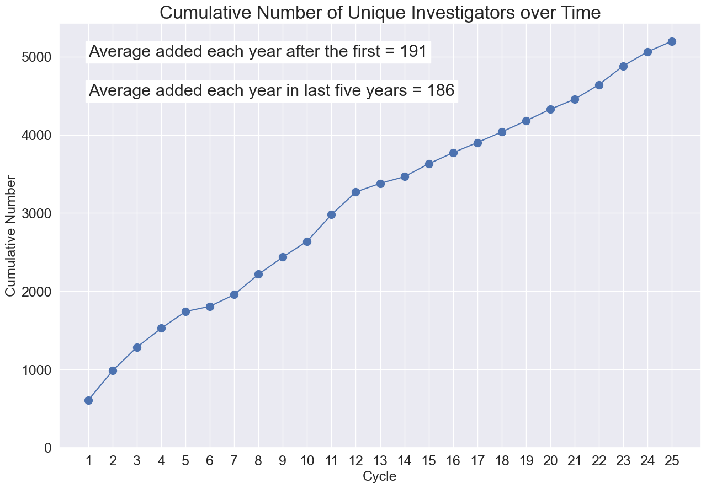

Proposal Data
=============

Cumulative Investigators and Students
-------------------------------------

The left panel shows the cumulative number of students, postdocs, and Ph.D. theses enabled by Chandra science. The right
panel shows the cumulative number of unique investigators who have been awarded Chandra time.

.. button-link:: _images/investigators.png
    :color: primary
    
    Download investigators and students plot

Oversubscription Rate of Proposals
----------------------------------

The plot shows requested exposure time from observing proposals and accepted time. The oversubscription rate is roughly a factor of 4. 

.. button-link:: _images/oversub.png
    :color: primary
    
    Download oversubscription plot
